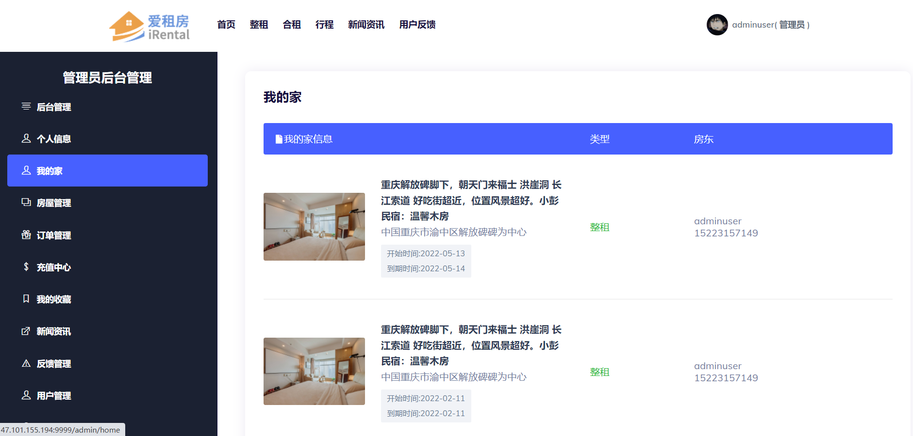
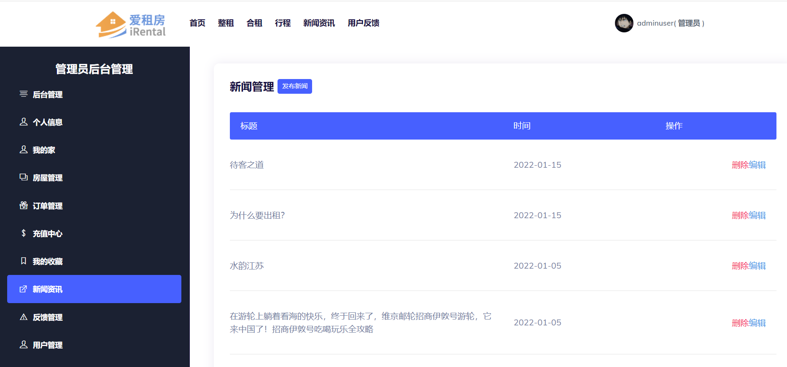

**需要完整代码可以加qq   931708230 或者加微信   wxid_r91ed6rslwdu22**

基于springboot房屋租赁系统 springboot+mybatis+mysql+shiro
一、功能介绍
包括管理员、房东、租客三种角色，外加游客(未登录情况)
出租类型包含整租和合租
权限 游客 < 租客 < 房东 < 管理员

项目效果截图

### 基础环境 :IDEA，maven3.6+，JDK 1.8， Mybatis 3.1， Mysql 5.8
### 源码+数据库脚本 
所有项目以及源代码本人均调试运行无问题 可支持远程调试运行

**需要完整代码可以加qq  931708230 或者加微信  wxid_r91ed6rslwdu22**
